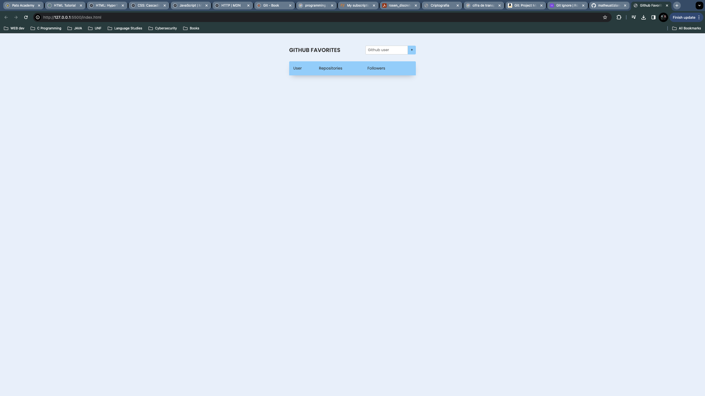
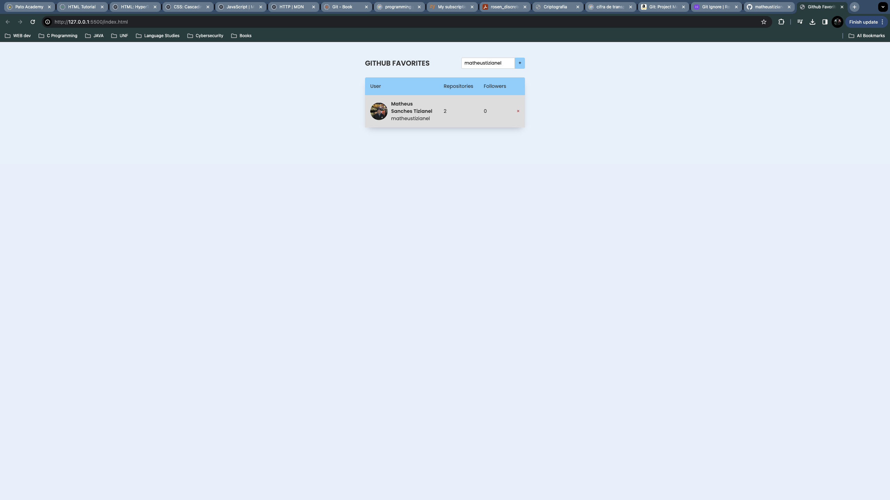

# Github Favorites Project

This project uses javascript to fetch github API and add some user info in a list.

<figure>
  
  <figcaption>Initial state</figcaption>
</figure>

<figure>
  
  <figcaption>User added</figcaption>
</figure>
